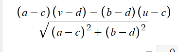
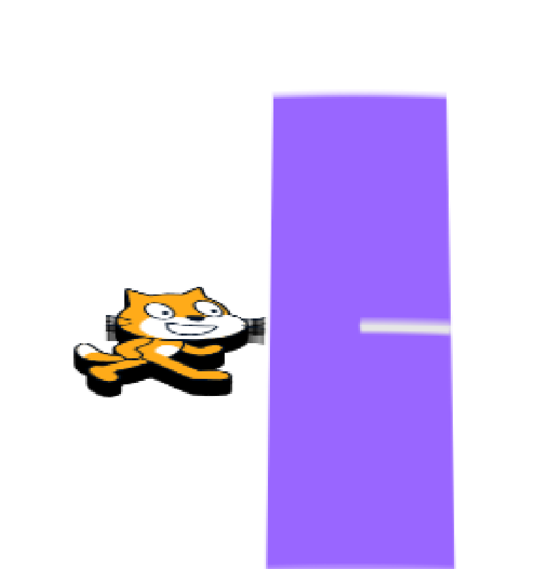

 supposedly im meant to make a new post now ig

trying to make a comprehensive library for goboscript for my own use

its a bit annoying to be using prefixes instead of namespaces because i want to have my internal module-wide 'global' vars to be restricted there without polluting the area

without operator overloading, calculations with complex numbers/vectors are also annoying, but tolerable.

The most annoying thing is that the macro system is a bit broken. You cant call a macro within a macro 

- but u can use a macro in a macro definition. This is a bit weird but i hope it gets fixed bcs it would be so useful for my struct system

Im trying to refactor my old code but its so bad

aaaa

 

need to add testing for every module

so i need assert.gs to work nicely first

maybe macros for defining whole functions could be funny#]

things im prolonging

- easing testing (how.?)

nvm

thinking about credits in goboscript. not sure how that would work

You can get the distance of a point to a line by taking a vector representing the line, and a vector to a point on the line to the point in question, and taking a determinant to get the area formed by the 2 vectors. Then, divide the area of the parallelogram by the side length that is on the line (i.e. the length of the vector representing the line), to get the perpendicular height of the parallelogram.

Like this ^^ where the line is from (a, b) to (c, d) and the point in question is (u, v)
 

man 3b1b is such a good yt channel

this is why goboscript macros are so funny (line intersection)

refactoring a lot of goboscript code rn

clip.gs is wiwo rn. have to rename some stuff and refactor some things for better code quality

just made tims button detector in gs. quite easy with macros actually

i need to make my f3d gs code more easy to use

f3d and thinkingplanely stretch are now in. cosfx is implemented!

